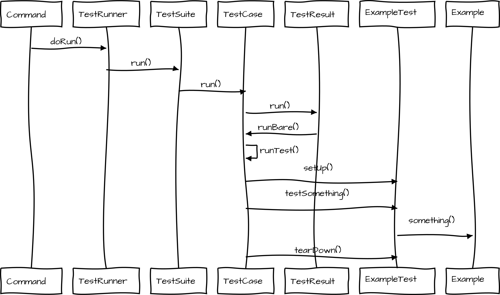

# CronTabManager

Компонент позволяет управлять крон заданиями из админки
Добавляет задания в crontab без использования адресной строки
Для работы необходимо чтобы на хостинге был доступ к функциями:  system и passthru для запуска из под php

### Добавление phpunit тестов

Создаем файл с названием в корне сайта **tests/DemoTest.php**

```php
<?php
class DemoTest extends MODxProcessorTestCase
{
    public function testSiteName()
    {
        self::assertEquals('REVOLUTION', $this->modx->getOption('site_name'));
    }

    public function testSiteStatus()
    {
        $site = (boolean)$this->modx->getOption('site_status');
        self::assertTrue($site);
    }
}
```

Создаем контроллер **core/scheduler/Controllers/demophpunit.php**

```php
<?php
use PHPUnit\Framework\TestSuite;

/**
 * Демонстрация контроллера
 */
class CrontabControllerDemoPhpUnit extends modCrontabController
{

    public function run()
    {
         // Запуск тестов в директории /tests/minishop2/ - запустить все тесты в этой директории
        $this->addTest('minishop2');

        // Запуск тестов в директории /tests/mini/Setting.php - запустить все тесты в этой папке
        $this->addTest('mini/Setting');

        // Запустит тест из файла tests/DemoTest.php
        $this->addTest('DemoTest');
        $this->runTest();
    }
}
```

После добавляем заадание в crontab менеджер и запускаем его

https://file.modx.pro/files/e/5/c/e5cb48ccffaeef677442972630484d8f.png

### Запуск из консоли

```bash
./vendor/bin/phpunit --filter DemoTest tests/DemoTest.php --bootstrap core/components/crontabmanager/lib/phpunit/MODxTestHarness.php  --testdox
```

или
**директория с тестами должна находить в корневой директории или указывайте путь до папки с тестами testsPath={ДИРЕТКОРИЯ}**
```bash
php core/scheduler/phpunit.php tests=frontend
```

### Схема работы PHPunit
Описание как работают PHP unit тесты

